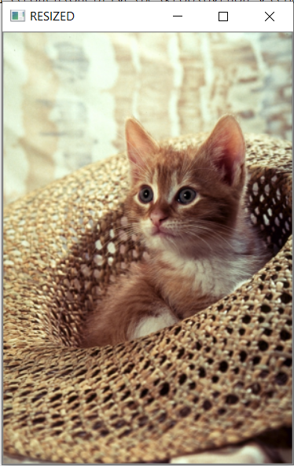

# Image-resizing
Image Resizing with Python

## Tools and Languages:


<br>

## Installation
Use the package manager [pip](https://pip.pypa.io/en/stable/) to install cv2 and numpy.


```bash
pip install cv2
pip install numpy
```

## Import

```python
import cv2
import numpy as np
```

## Reading image from file
Here we are using 'cv2.imread()' method to read samples.

```python
img = cv2.imread("cat.png")
```


## Img resizing<br>
### Theory:(Demonstrated Down-scaling)
Here we are using a bit better method to resize an image, preserving the aspect-ratio rather than using normal resizing.<br>
1.Set the scale-percentage i.e percentage upto which, we want to downscale.<br>
2.Build new width of the resized image i.e (Original image width * scale_percent).<br>
3.Build new height of the resized image i.e (Original image height * scale_percent).<br>
4.Storing height and width.<br>
In the next snippet we are using interpolation to finally resizing it.<br>

```python
scale_percent = 0.60
width = int(img.shape[1]*scale_percent)
height = int(img.shape[0]*scale_percent)
dim = (width,height)
```

## Implementing interpolation 
As we are demonstrating Down-scaling or shrinking the scale, we will be using *cv2.INTER_AREA* 
method of Interpolation
```python
resized = cv2.resize(img,dim,interpolation = cv2.INTER_AREA)
```

## Comparing original vs resized

```python
cv2.imshow('ORIGINAL',img)
cv2.imshow('RESIZED',resized)
cv2.waitKey(0)
cv2.destroyAllWindows()
```

## Images
<p align="center">
	
	
</p>

### Developed by
 [Ashish ku. Behera](https://github.com/ashish-max "Github Id")
